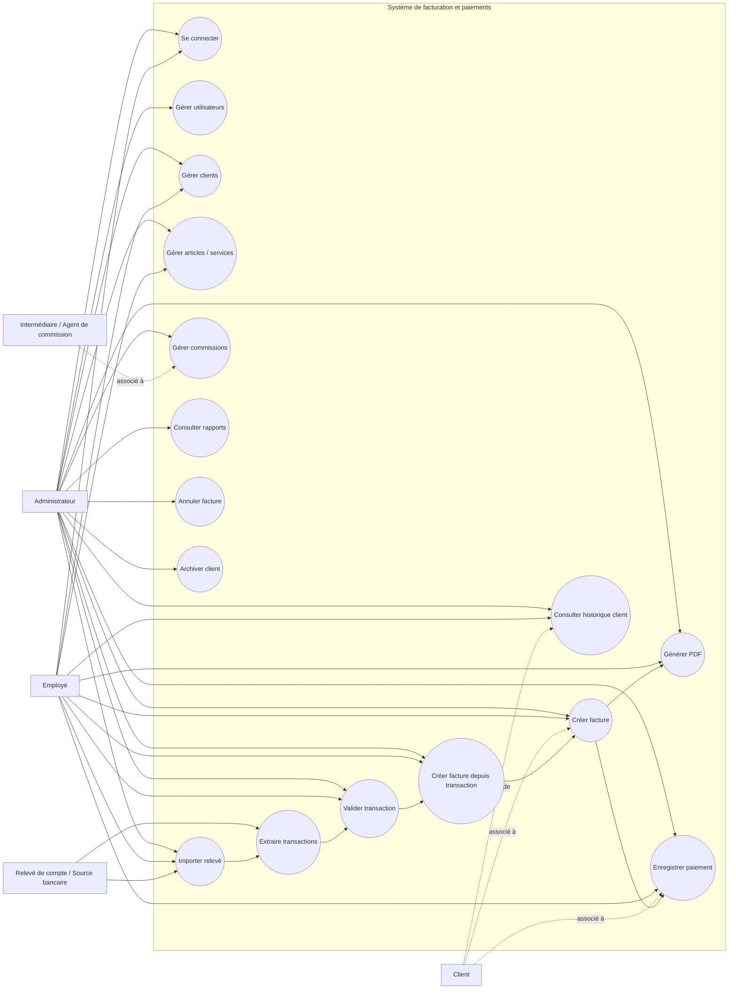
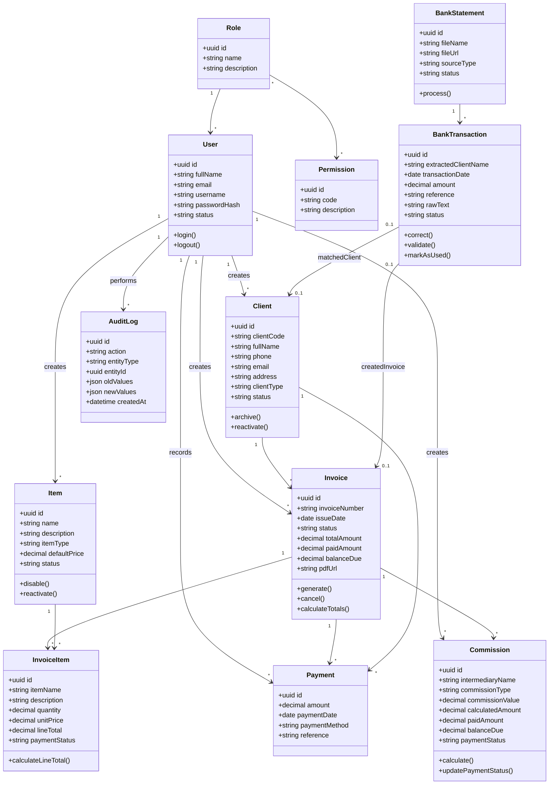
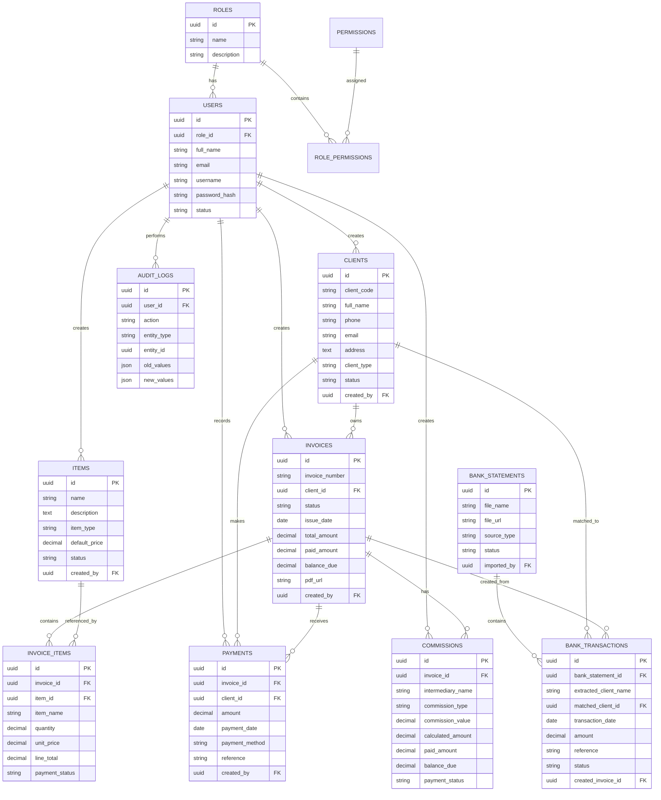
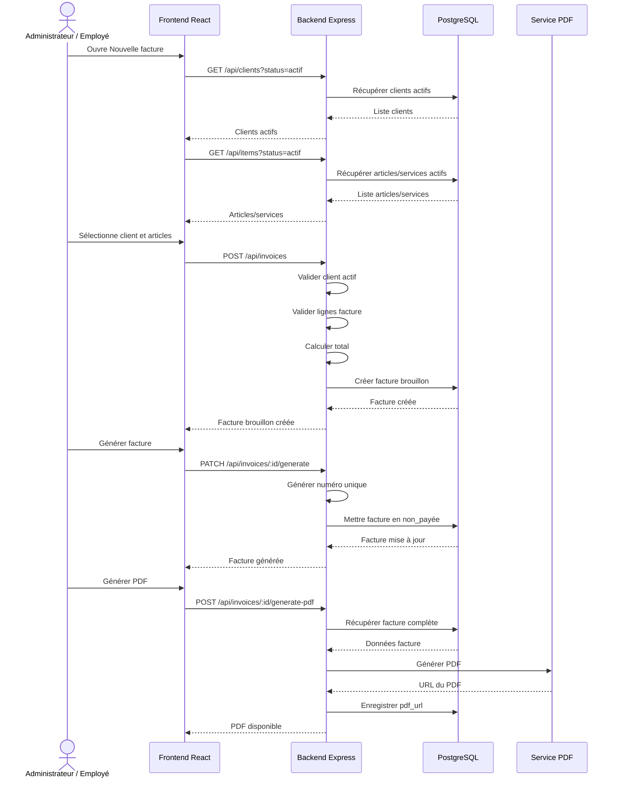
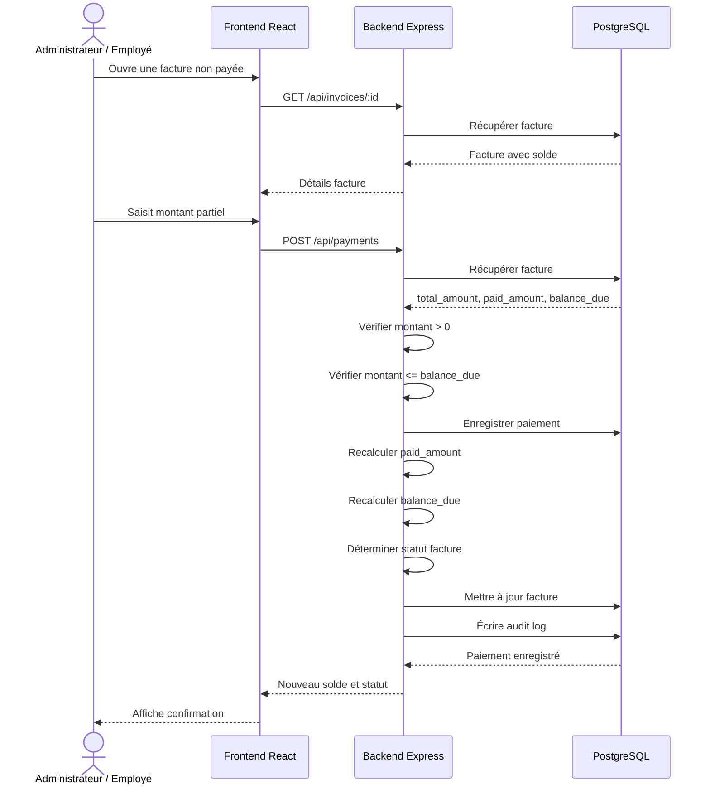
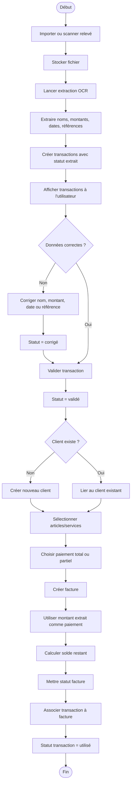
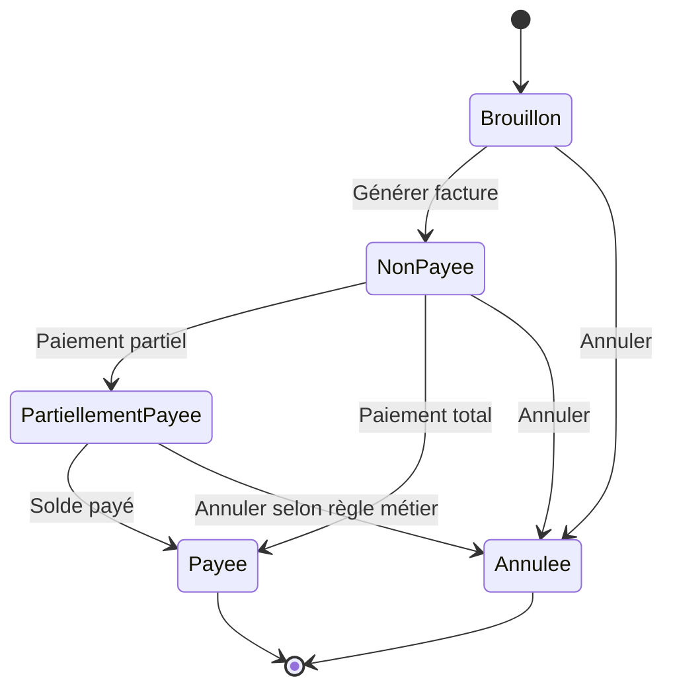
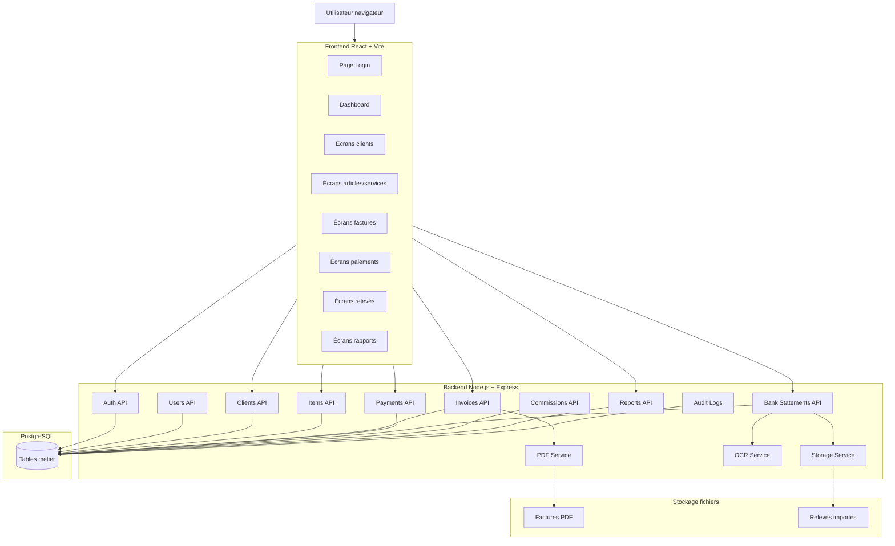
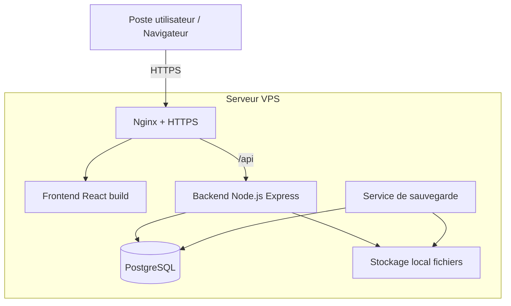
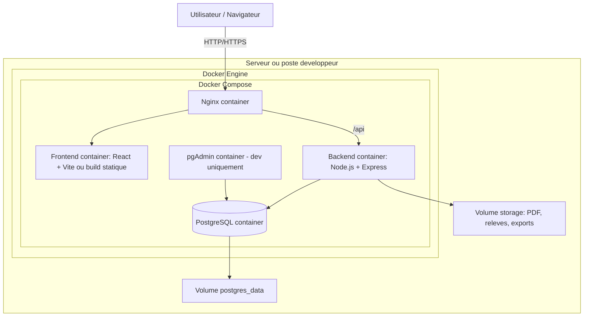

# Diagrammes UML — Système de facturation et paiements

## 1. Diagramme de cas d’utilisation global

---

## 2. Diagramme de classes principal

---

## 3. Diagramme entité-relation ERD

---

## 4. Diagramme de séquence — Création d’une facture manuelle

---

## 5. Diagramme de séquence — Paiement partiel

---

## 6. Diagramme d’activité — Facture depuis relevé de compte

---

## 7. Diagramme d’état — Cycle de vie d’une facture

---

## 8. Diagramme de composants technique

---

## 9. Diagramme de déploiement V1

---

## 10. Diagramme de deploiement corrige avec Docker

